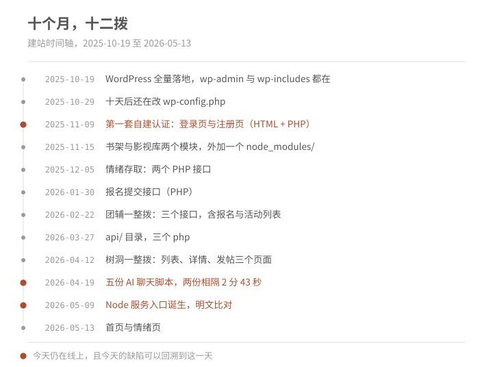
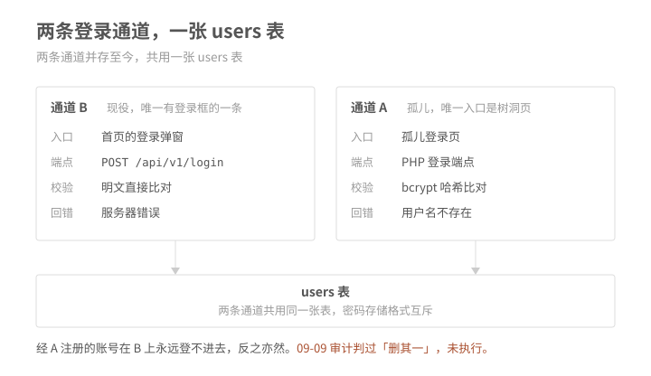
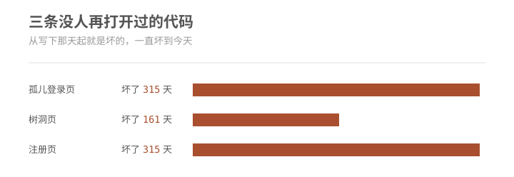
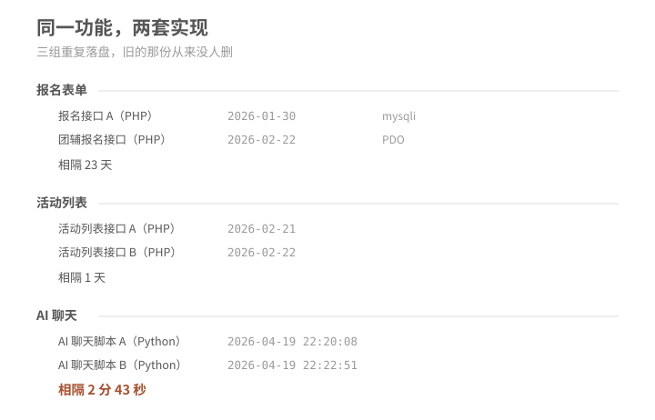
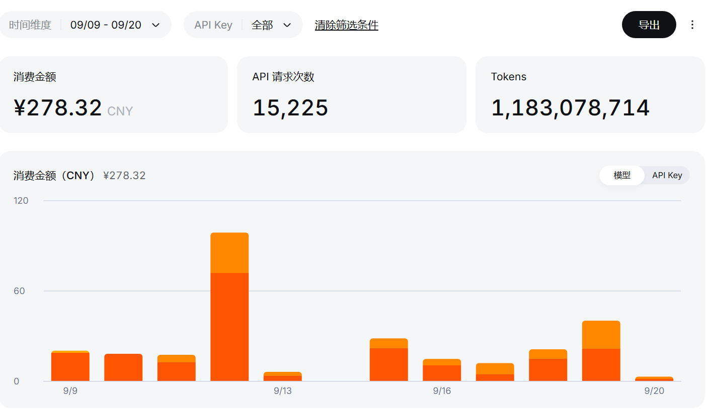

#### 引言
あれあれ~，本文涉及的个人信息和具体的项目信息均作过脱敏处理，出于纯技术目的分享，如果需交流经验请在个人首页联系个人邮箱喵~

## 飞光

“金钩细，丝纶慢卷，牵动一潭星。“农历八月翻开新叶，七月立项，九月正式接手，从九月九日到九月十九日十日阶段性结项。得益于项目负责人提供的“无限火力”，解决了我的后顾之忧，我快速地完成了前期设定的需求。由于首次接手这种规模的任务，在初期使用方面多有生涩，但是这些试错成本实际上是极低且必要的，从而就产生了这一篇文章。

## 青天高

九月九日，开始接手，整个项目是一个心理咨询网站，我首先将网站原地备份，然后拉取除数据库文件外的备份到本地，进行进一步的探查。

这些问题的根子是同一个——交接之前，没有人持续维护过它。下面四条只是它露在不同层面的样子。

项目的基础情况如下：

1. 本地的项目版本管理混乱，也可以说完全没有版本管理：；
2. 网站有两套登录逻辑：一套用 Node，登录框在首页；另一套用 PHP，登录页没有样式，服务器返回什么就直接弹窗显示什么。这个页面只能从树洞页跳转过去，偏偏那里的登录检查也有问题。9 月 9 日审查代码时就提出过，两套登录逻辑应该只保留一套，但一直没有改。；
3.  三处都不是「写错了」，是「写完就没有人再打开过」；
4.  三组里没有一组是「重构」，都是「复制一份再改」，旧的那份从来没删。

开始之前，我的配置是：Claude Code+deepseek v4.1 flash/deepseek v4 pro。而我负责做网关中的一个审核层。

> *关于我对网关的定义：*
> 1. *agent只能代劳的是"汇总+监听+审查+复盘“这个功能组合，这个组合体构成了执行层；*
> 2. *人类在其中扮演的是整个权力关卡，“授权，凭据持有，现实反馈”都要依靠人类；*

然后我的Claude Code由于使用的是第三方模型，所以默认上下文是200K（实际上有1M），自动压缩是在167K（约83%）启动。

介绍完以上基本情况，下面我将开始介绍我的经历。

## 黄地厚

开始我根据我的探查文档初步地介绍了我的需求：

1. 优化前端，减少ai味，使用成熟的ui设计；
2. 删除重复的后端设计，减少攻击面，提高用户数据安全性；
3. 增加聊天助手，丰富网站功能；
4. 加入合规性审查，使之符合法律规范；

我的第一步就是直接把SPEC v1.1文档丢进Claude Code的上下文窗口，并且指定首先设计一整套具有辨识度的 token（虽然不清楚token这里是什么意思，但是本着拿来主义的精神，这里就借用一下了）。这一次设计比以前deepseek的规范要优秀一点，现在应该是后训练的时候加入了关于前端的数据，考虑的维度覆盖了：补色关系；用色数量；主题色的明度对比；文字色阶；还有卡片的圆角弧度……

我的第一天从中午十一点半开始到晚上十一点几乎不间断地盯着同一个窗口改需求，但是由于上下文窗口不匹配，反复触发压缩，导致账单膨胀。可以看到的是在这份账单09-12的时候，账单飙升至了近100元，但是实际上产出极其低效。

我的前端设计完成后，进入下一轮时，忘记卸载mcp，也加重了上面的情形，因此，第一次的“子弹”一天就突突完了。（Os：这种“使唤人“的感觉在初期能够满足虚荣，但是变成实际上处理问题、解决需求就变成了效率与投入的平衡与计算的问题，在经历了在电脑前不间断盯将近十二个小时，在电脑关机后也是深深地嵌入椅子，一点精气也没有了，像是刚出土的木乃伊……）

于是，提升效率成为了迫在眉睫的事项。

---

根据我过去接触到的信息，我首先想到了“多代理混合评审”或者类似于“一个中央网关管控多个子代理”，因此我在09-15尝试使用Codex做这个中央网关（彼时我还并没有对“网关”这个名词有具体的感知，只是知道使用“聪明”的模型做路由和审查，可能会既能够保证质量，又能够利用高性价比模型的价格优势，而且能够减少人类的决策成本）。当时使用的是GPT-5.6 Sol ，特点就是输出少（跟我的设置有关），思维链长，人类介入部分极少。它能够在后台使用“claude -p"这个指令从非交互式界面拿到服务端的输出，显得人”无事可做“。

当我观察他的思维链时，它的工作方式给了我启发。首先就是人无法替代，或者说目前阶段deepseek 暂时无法替代Codex的一点是"下简报前实测上游、把失败模式写进契约"这个动作。在Claude Code窗口派发的子代理无法通过总代理完成自动的“review+落成文档",还有在总代理与子代理的指挥之间权责划分不清：谁能写入文档？谁能动顶层设计？探查结果与SPEC矛盾是否自动回滚？等等问题常常造成混乱，虽然能够在表面上执行我想要的”按需路由模型+汇总报告+申请人类权限+自动编排串并行任务“，但是实际上由于顶层的无法自行裁定子代理，或者顶层出现幻觉，没有退出机制导致反复栽坑，这都是第一轮的教训。

GPT-5.6的做法和规则是：用户已确认>现有代码>SPEC文档，在行使网关的功能时，自己只对返回的结果进行审核而不写入仓库，在任务中出现：*它删掉自己刚写的那段进度，原地换成 ## CLI 网关运行边界（用户 2026-09-15 更正）：「本网关只选择模型、派发任务、检查返回和更新状态；仓库修改交由本地 Claude Code CLI。」* 

随后 18、19 两日，我靠着它的规范，虽然仅仅是通过我的“人肉”网关，但也是凭借着既有的提示词和SPEC文档，顺利地完成了。后续更多的是合规性审查和法律边界的确认，虽然代码量和产出极少，但是人类的判断密度极大，实际上占用了很大的工作量（这一点让我头疼不已），再加上处理后端的混乱版本问题（实际上只是打了一个补丁），终于将预定功能上线。（好耶！！）以下放一张截图：

## 日月明

先说清这份总结的边界：以下不是控制变量实验，也无意证明某一种架构具有普适最优性。模型、任务阶段和工具链在这十天里都发生过变化，我手里只有一个样本。我能确定的只有三件事——旧工作流在哪里失败，新工作流如何约束这些失败，以及哪些设计在这个项目里表现出了可复用性。这是一份经过抽象的 case study，不是 benchmark paper。

对于初期的账单失控可以归因到四方面：
1. 模型本身：首先就是模型侧的“幻觉”和“废话多”造成噪音进入上下文；
2. 配置：其次是上下文窗口设置和压缩节点的管理与实际任务的错配；
3. 环境：不需要加载的mcp和skill反复进入上下文；
4. 调度：串并行没有提前分配，导致不能充分发挥不同模型特性和提高时间效率；

以上导致每次都要全量加载43%的上下文窗口，一次对话就能够膨胀到60%，两次基本就要压缩重置。这是我第一阶段遇到的难题。短文本可以减少进入 KV cache 的总量，而且可以最大化利用模型的 “注意力”（这里是我定义的概念，说明的是在最大上下文窗口内，有一个 “甜区”，也就是工程效率较优区间），以上都是直觉的判断，但是下面是我找到的一些支持：

在模型侧，关于其病因形成机制如下：
长度膨胀是 RLHF/RLVR 最经典的 reward hacking 之一：如果奖励模型或验证器（哪怕是隐含地）偏好"更详尽/更周全"的答案，RL 就会把长度本身当成得分手段；而且幻觉和废话会互相喂养：模型对自己的输出没有"我说得太长了"的反馈回路，长输出里更容易出现没有上下文支撑的填充句，填充句里的实体就是幻觉的产地。"话痨"和"编造"在这条链上是同一个病的两个症状。

在环境侧，更是该特性的放大器：
长上下文本身会让模型变笨——稀疏注意力的选漏、KV 的数值有损、softmax 的稀释，是三条各自独立的机制，其中稀疏注意力本身就是针对 softmax 稀释的对策，不是同向叠加（详见尾注 [1]、[2]、[3]）。这一侧跟模型性格无关，是环境。

还有一点就是长文本任务和上下文窗口的错配，虽然短上下文能够节约成本，减少每轮进入上下文的 KV cache ，但是总成本还要与成功率挂钩：

$${\large E=\frac{\text{Accepted Work}}{\text{Token Cost}}}$$

所以灵活地调整上下文窗口设置处理长文本，可以取得单次花费和整体项目成功率之间的平衡。

对于以上问题，我暂时悬在上方，不提出解决方案，先看看之后我的做法对前面有没有启发。

---

09-15到09-17是我工作的第二个阶段，这个阶段 ChatGPT 给我的启发很有意义，主要集中于从agent权责边界的划分提高整体任务的效率。可以大致地归功于高质量的$Workflow$形成的Agent Governance，以下是我通过回看我的总线总结的：

1. 工具集即权限面。--tools Read,Glob,Grep = 只读侦察；加上 Edit 才是写授权。授权范围不靠嘱咐，靠能力边界——它没法越权，因为没有那个工具。
2. 预算写在调用里。--max-budget-usd 0.05→3.00 按任务定档。成本不是事后算的，是参数。
3. 红线放在尾部，且是枚举式否定。"不读 env、口令或用户数据；不写文件、不部署、不运行命令"——否定约束比肯定指令可靠。
4. 失败即停。"若任一文件读不到则停止、不编辑"、"若 SPEC 读不到则停止不编辑"。fail-closed，这一条极少见，但它是防止"猜着干"的办法之一。
5. 返回值形状被指定。"返回修改章节、仍待用户决策项及你做的自检"——要求执行者自证。验收因此变成机械比对。
6. 输出在边界处过滤。--output-format stream-json 再经 PowerShell 只抽 result / assistant 文本 / TOOL 名。子代理的原始转写从不进入网关的窗口，只进摘要。

这里我引入一个模型：

$$\boxed{\text{Human Authority}\rightarrow \text{Gateway}=\{\text{Context},\text{Capability},\text{Budget},\text{Failure},\text{Output}\}\rightarrow \text{Worker Execution}}$$

这个 $Workflow$ 中，$Gateway$就是我前面提到过的网关，其中在$Gateway$到$Sub Agents$的过程中运用到了一种名为“渐进式披露”的方法，减少了每次进入上下文的token，披露内容同样由中间的ChatGPT完成；另外“串并行路由”也可以缩短人的等待时间，提前根据是否写入统一文件，流程是否受人类授权阻塞，流程间是否互为条件，都是路径优化需要考虑的（虽然但是小项目比较简单就是了a(^-^)a）

他的提示词中不只是"把大任务切成小任务"，而且每份简报自带失败预案。比如：

> 不得写成「a 是文字 → crisis，否则 none」这种反转默认的写法。 …默认值只能是 crisis，跳过只能是白名单式的例外

它预判了执行者最可能走的那条错路，并提前堵死。 光这一份简报，在下任何代码之前就拦下 5 处缺陷（1 处假证据 + 1 处定义缺口 + 3 个错数字）。

同时在预算控制方面，14 次 claude -p 派发，预算上限分六档：0.05 / 0.75 / 1.00 / 1.50 / 2.00 / 3.00 美元；工具集按任务收紧（侦察用 --tools Read,Glob,Grep，执行才给 Edit）；每条 prompt 尾部都嵌着红线——"不读 env、口令或用户数据；不写文件、不部署、不运行命令"。权限按照事先的探查结果放出，解决了低效的问题。

总之优秀的治理策略可以极大地缓解我在项目接手之初的问题，也是我从本次经历中得到的全部经验，以下是问题到解决方案的映射：

| 第一阶段暴露的问题          | 第二阶段约束     |
| ------------------ | ---------- |
| 无关信息持续进入窗口         | Context    |
| Agent 权责不清         | Capability |
| 调用成本失控             | Budget     |
| 信息不足仍继续执行          | Failure    |
| 子 Agent 原始输出污染中央窗口 | Output     |
## 苦昼短

从深嵌的椅子中脱出身形，不觉已进秋里，离中秋已是不远，所谓”一场秋雨一场寒“，这场秋来得紧，来的湿润。很少见地，看见秋天的早晨有着浓重的溽气，也许是暑气还没有消的缘故，空气仿佛真的能挤出水来。并不惊讶于今年反复的气候，倒是庭前的彼岸花开得让人欣喜，（让人想起《莉可丽丝》里的百合姐妹花，想起《86-不存在的战区》里的“破碎的弹片交织与无尽的花海间，我们没有忘记彼此的誓言“）由于常常客串在各种番剧中，突然看见，也是一眼认出那血红色，像是一匹野马颈上的一缕桀骜不驯马鬃，在冷调的景色中热烈、奔放。

“此岸”——我与大象席地而坐，也许它不懂赫拉克利特所谓“逻各斯”的隐秘，不解德谟克里特“原子论的奥妙，惑于亚里士多德“地心说”的神奇，但是也无妨，因为当语言阻塞了意义，我愿意等……
#### 尾注

[1] **稀疏注意力 top-k 选择**——DeepSeek 的 DSA（Sparse Attention）先用一个轻量 indexer 给每个历史位置打分（各注意力头用一组学习到的门控权重，对 ReLU(q·k) 加权求和），再只保留得分最高的 top-k 个位置进注意力，其余全部掩成 −∞（开源代码里 k = 2048）。要紧的不是省下多少算力，而是**选漏的代价**：没被选中的位置不是"看得模糊"，是**完全不可见**，而且模型不知道自己没看到。候选池随上下文变长，选漏概率随之上升。后续的 CSA2、GLM-5.2 的 IndexShare 把这一步做得更省（实测相邻层的选择重叠达 70–100%），代价是一次选错会被相邻层一起继承。来源：DeepSeek-V3.2-Exp 技术报告；NVIDIA TensorRT-LLM《Optimizing DeepSeek-V3.2 on NVIDIA Blackwell GPUs》；S. Raschka, *DeepSeek Sparse Attention*。

[2] **KV 数值压缩**——KV 缓存是模型"读回上下文"时的那份副本，而它是可以打折扣的。V4.1-Flash 把它压到约 890 B/token（约为上一代 V4-Flash 的 1/4，持久化后约 1/8，相对初代 V1 是 437 倍），数值格式为 FP4（E2M1，每 16 个通道共用一个 E4M3 缩放因子）。也就是说，读回来的上下文本身带着量化误差，数字、ID、文件路径这类低冗余信息首当其冲，且误差随上下文增长而累积。来源：DeepSeek-V4.1-Flash 模型卡与技术报告。

[3] **softmax 稀释：它和注 1 不是并列关系**——注意力权重经 softmax 归一化，总和恒为 1；候选位置越多，每个位置能分到的权重越少，分布越平。这是长上下文"变笨"最常被引用的根因。而稀疏注意力（注 1）恰恰是针对它的对策——只让模型看少数最相关的位置，把权重集中回来。所以注 1 与注 3 是"疗"与"病"的关系，不是两个同向叠加的退化项；注 2 则是另一条独立的省法。三者合起来说的是同一件事：**长上下文里，模型看到的不是原文，而是被选择过、被压缩过的版本。**
