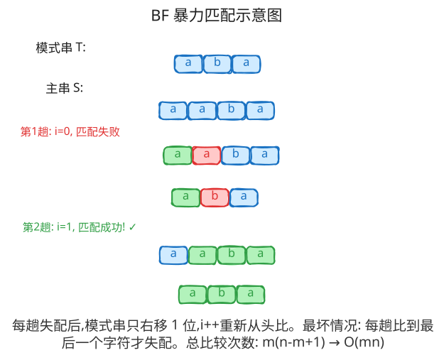
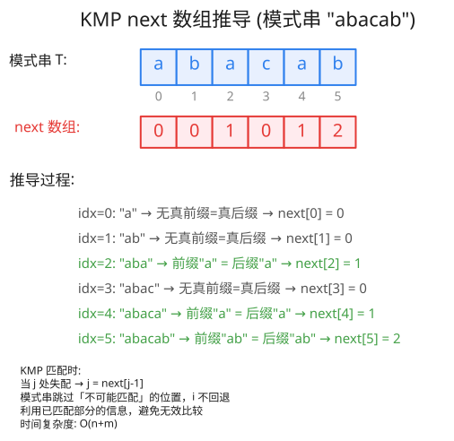

###  什么是字符串匹配

#####  定义
*definition：* 
又称模式匹配(pattern matching)。该问题可以概括为：“给定字符串 $S$ 和 $T$，在主串 $S$ 中寻找子串 $T$。”字符串 $T$ 又被称为模式串(pattern)。

##### 类型
*type：* 
1.单串匹配：给定一个模式串和一个待匹配串，找出前者在后者中的所有位置。
2.多串匹配：给定多个模式串和一个待匹配串，找出这些模式串在后者中的所有位置。
	2.1：出现多个待匹配串时，将它们直接连起来便可作为一个待匹配串处理；
	2.2：可以直接当作单串匹配，但是效率不够高；
3.其他类型：例如匹配一个串的任意后缀，匹配多个串的任意后缀......

####  暴力做法
*BF：*
简称BF(Brute Force)算法，该算法的基本思想是从主串 $S$ 的第一个字符开始和模式串 $T$ 的第一个字符进行比较，若相等则继续比较至后续字符；否则模式串 $T$ 回退到第一个字符，重新和主串的第二个字符进行比较。如此往复，直到 $S$ 或 $T$ 中的所有字符串比较完毕。

##### 实现
```cpp
/*
	s: 待匹配的主串
	t: 模式串
	n: 主串的长度
	m: 模式串的长度
*/
std::vector<int> match(char *s ,char *t,int n,int m){
	std::vector<int> ans;
	int i,j;
	for(i = 0; i < n - m +1; i++){
		for(j = 0;j < m; j++){
			if(s[i + j] != t[j])
			break;
		}
		if(j == m)
		ans.push_back(i);
	}
	return ans;
}
```

##### 时间复杂度

设 $n$ 为主串的长度，$m$ 为模式串的长度，默认 $m \ll n$。

BF算法匹配成功时，在最好的情况下，只有一趟匹配成功，此趟比较次数为 $m$，而其余每趟不成功的匹配都发生在模式串的第一个字符，还需要 $n-m$ 次比较，总比较次数为 $n$，故时间复杂度为 $O(n)$；在最坏情况下，匹配成功的趟数为 $n-m+1$，每趟比较次数为 $m$，总比较次数为 $m(n-m+1)$，故时间复杂度为 $O(mn)$。

BF算法匹配失败时，在最好情况下，每趟不成功的匹配都发生在模式串的第一个字符，BF算法要执行 $n-m+1$ 次比较，时间复杂度为 $O(n)$；在最坏情况下，每趟不成功的匹配都发生在模式串的最后一个字符，BF算法要执行 $m(n-m+1)$ 次比较，时间复杂度为 $O(mn)$。

如果模式串中至少有两个不同的字符，则BF算法的平均时间复杂度为 $O(n)$。



### KMP算法

##### 一些定义

*前缀*：从串首开始到某个位置 $i$ 结束的连续子串。字符串 $S$ 的以 $i$ 结尾的前缀记作 $\mathrm{prefix}(S, i) = S[0, i]$，其中 $0 \le i \le |S| - 1$。

*真前缀*：除字符串 $S$ 本身之外的所有前缀，即 $\mathrm{prefix}(S, i)$ 中满足 $0 \le i \le |S| - 2$ 的部分。

*后缀*：从某个位置 $i$ 开始到串尾结束的连续子串。字符串 $S$ 的以 $i$ 开始的后缀记作 $\mathrm{suffix}(S, i) = S[i, |S| - 1]$，其中 $0 \le i \le |S| - 1$。

*真后缀*：除字符串 $S$ 本身之外的所有后缀，即 $\mathrm{suffix}(S, i)$ 中满足 $1 \le i \le |S| - 1$ 的部分。

下面我们看一组示例字符串



这个 $next$ 数组到底起着什么作用呢？假设有一个字符串 “abacad" 现在作为模式串跟主串匹配，当我比较到下标为[5]的时候与主串不匹配，我们看前一位的 $next$ 数组的值为1，搜索下标为[1]对应的主串的字符，然后[0,1]这个区间内的字符为已匹配的前缀。

为什么我们要在不匹配的时候看前一个下标对应的 $next$ 值呢，实际上我们对比朴素算法(BF算法)，我们可以发现，我们在失配的瞬间，我们已经匹配上了 $S$ 的前 $next[j - 1]$ ，$next$ 数组已经储存了匹配成功的 $prefix$ ，反观BF算法，将文本指针 $i$ 清零，然后将刚刚匹配过的窗口($border$) $[i - j]...[j - 1]$ 重新比较一遍，这些全是多于操作。这也就是KMP算法优于BF算法的原因。

 一句话总结：失配后唯一合法的降级目标，是已匹配部分 $P[0..j-1]$ 的 $border$；$prefix[j-1]$ 是其中最大的一个，既保住了最多已确认的进度，又通过 border 链不漏掉任何更小的候选，所以直接跳过去零多余比较。在上一轮DFA 的视角下，这就是用 $prefix$ 按需计算失配转移 $δ(j, text[i])$，而文本指针永不回退正是 DFA 逐字符推进的体现。

### 尾迹
来来回回，删删改改，已经一整天了。也许KMP算法只是 $C++$ 算法中微不足道的一环，而我的知识储备也仅仅是沧海一粟，越是学得深入，越觉得自己无知。我愿做那个木桶里的迪奥根尼，隔绝市井的喧嚣，在太阳的浸润中，温养岁月绵长，慨歌未央......  


###### 参考文献
[1]([字符串匹配 - OI Wiki](https://oi-wiki.org/string/match/))