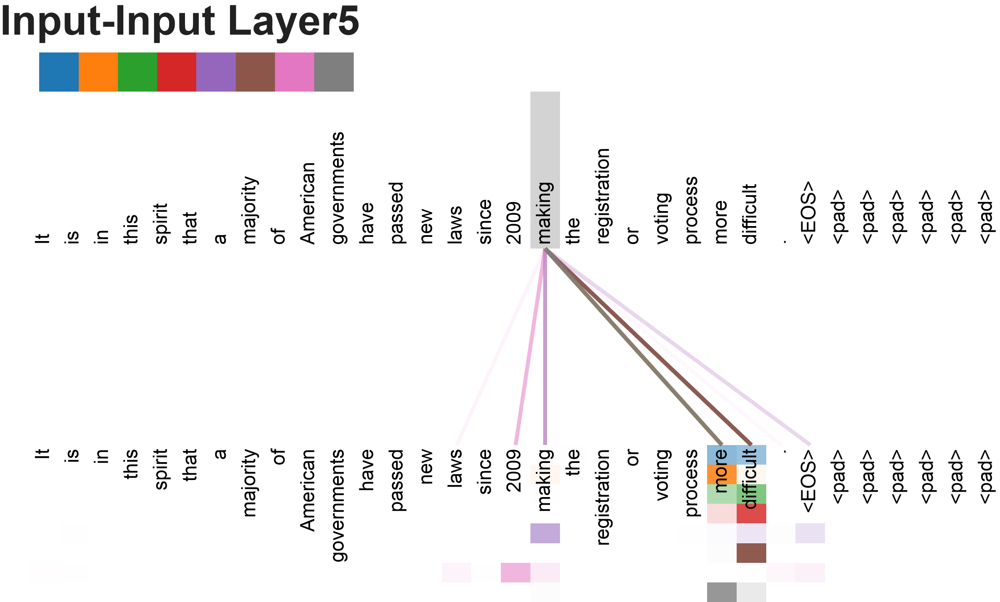
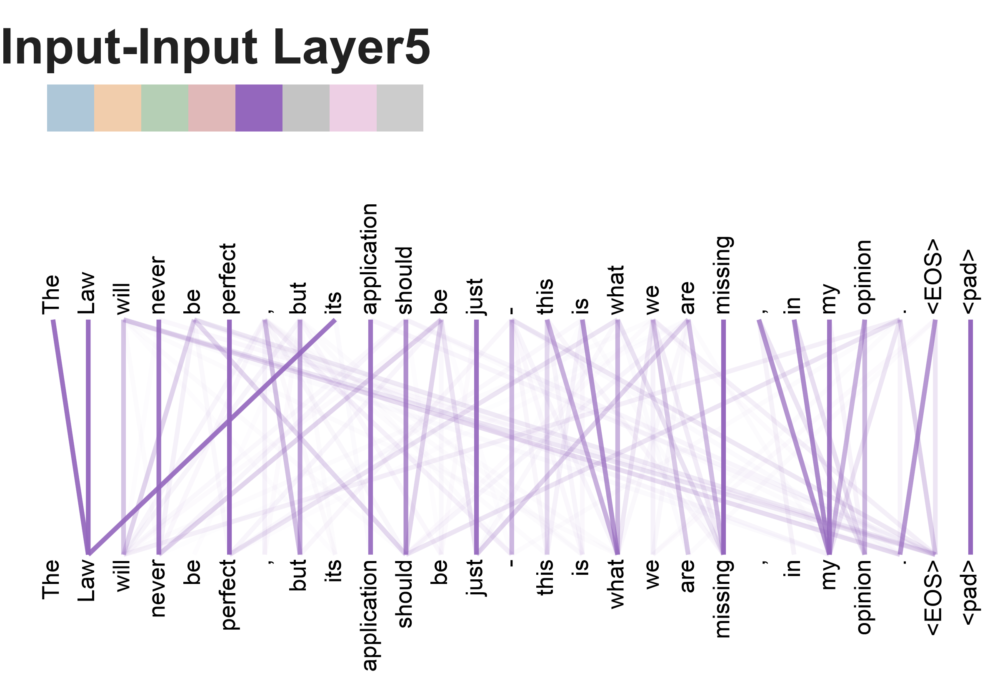
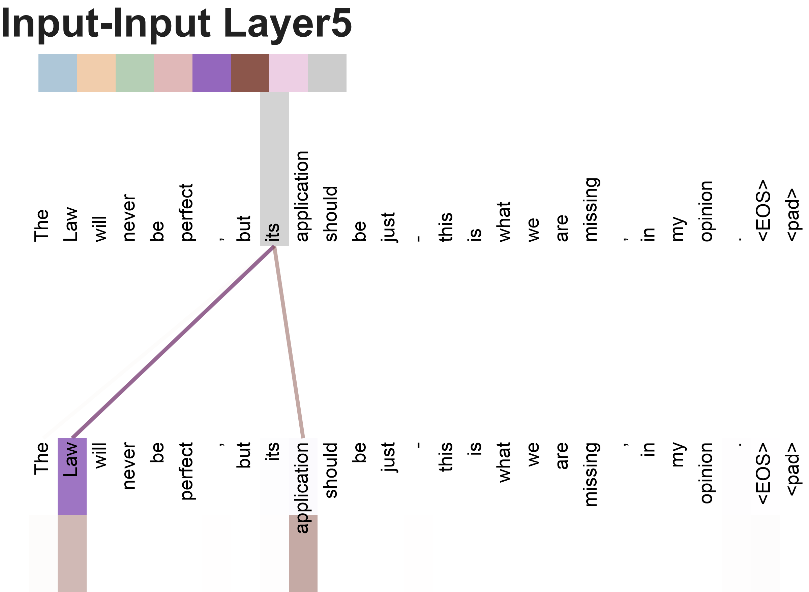
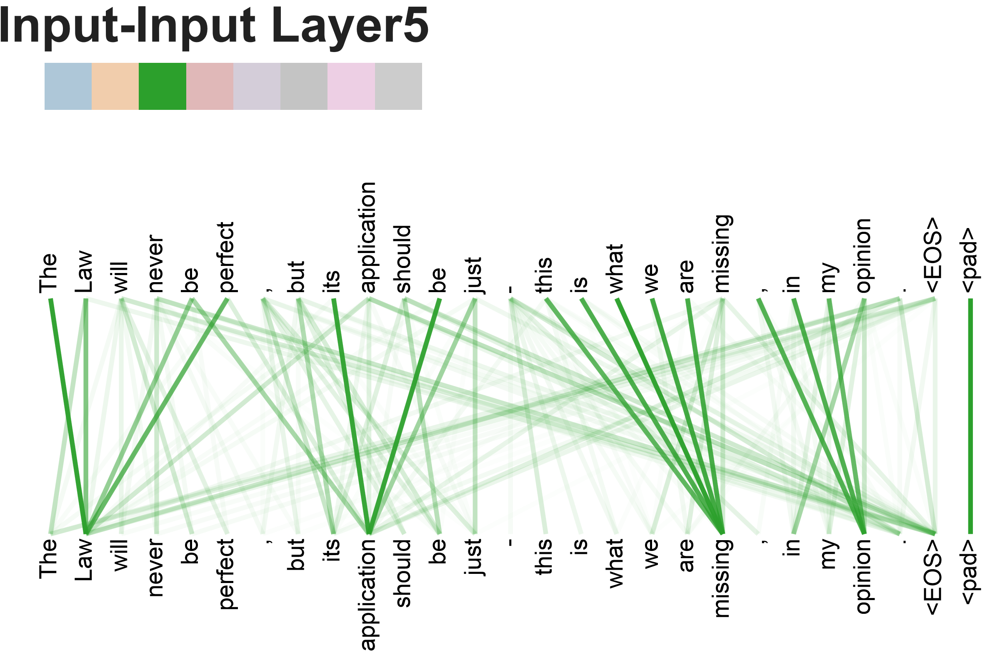
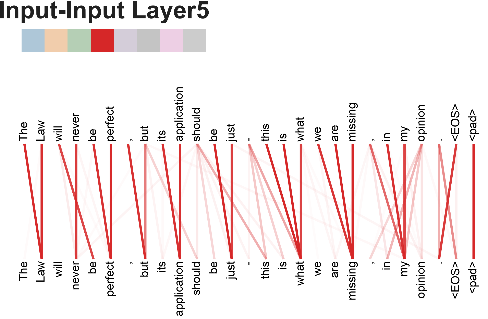

---
title: Attention is all you need（中文翻译）
date: 2026-08-08
layout: page
comments: false
description: "Transformer 论文《Attention Is All You Need》全文中文翻译 —— 自注意力机制、模型架构、训练与结果完整解读，附全部图表。"
---

> **原文标题**：Attention Is All You Need
> **arXiv 编号**：1706.03762v7 [cs.CL]（2023 年 8 月 2 日版）
> **作者**：Ashish Vaswani、Noam Shazeer、Niki Parmar、Jakob Uszkoreit、Llion Jones、Aidan N. Gomez、Lukasz Kaiser、Illia Polosukhin
> **发表**：31st Conference on Neural Information Processing Systems (NIPS 2017), Long Beach, CA, USA
>
> **翻译说明**：本文为论文全文中文翻译。专有名词、人名、参考文献、表格中的数据与模型名称均保留原文；数学公式按原文 LaTeX 重新排版。文中方括号 [n] 为原文参考文献编号。

---

## 摘要

占主导地位的序列转换（sequence transduction）模型基于复杂的循环（recurrent）或卷积（convolutional）神经网络，它们包含一个编码器（encoder）和一个解码器（decoder）。性能最好的模型还会通过注意力（attention）机制将编码器和解码器连接起来。我们提出了一种新的简单网络架构——**Transformer**，它完全基于注意力机制，彻底舍弃了循环和卷积。在两项机器翻译任务上的实验表明，这些模型在质量上更优，同时更易于并行化，并且训练时间显著缩短。我们的模型在 WMT 2014 英德翻译任务上达到 **28.4 BLEU**，比此前包括集成（ensemble）在内的最佳结果提高了 2 个多 BLEU。在 WMT 2014 英法翻译任务上，我们的模型在 8 块 GPU 上训练 3.5 天后，以 **41.8 BLEU** 创下新的单模型最先进（state-of-the-art）分数，训练成本仅为文献中最优模型的一小部分。我们还成功将 Transformer 应用于英语成分句法分析（constituency parsing），在数据充足和数据有限两种情况下都表现良好，证明了其良好的泛化能力。

> **脚注（贡献说明）**：均等贡献。作者顺序为随机排序。Jakob 提出用 self-attention 替代 RNN 并启动了评估这一想法的尝试。Ashish 与 Illia 设计并实现了最初的 Transformer 模型，并在该项工作的每一个方面都深度参与。Noam 提出了 scaled dot-product attention、multi-head attention 和免参数的位置表示，并几乎是唯一参与了几乎所有细节的人。Niki 在我们最初的代码库和 tensor2tensor 中设计、实现、调优并评估了无数模型变体。Llion 也实验了新颖的模型变体，并负责我们的初始代码库、高效的推理和可视化。Lukasz 和 Aidan 花了无数个漫长的日夜设计并实现 tensor2tensor 的各个部分，替换了我们早期的代码库，极大改善了结果并大幅加速了我们的研究。
>
> （注：部分工作完成于 Google Brain，部分完成于 Google Research。）

---

## 1 引言

循环神经网络（RNN），特别是长短期记忆网络（LSTM）[13] 和门控循环神经网络（GRU）[7]，已被牢固确立为序列建模和序列转换问题（如语言建模和机器翻译 [35, 2, 5]）上最先进的方法。此后众多工作继续推动循环语言模型和编码器-解码器架构的发展 [38, 24, 15]。

循环模型通常沿着输入和输出序列的符号位置对计算进行因式分解。通过将位置与计算时间步对齐，它们生成一个隐藏状态序列 h_t，它是前一隐藏状态 h_(t-1) 和位置 t 的输入的函数。这种固有的顺序特性阻碍了训练样本内部的并行化，而在较长序列上这一点变得至关重要，因为内存限制限制了跨样本的批处理。近期工作通过因式分解技巧 [21] 和条件计算 [32] 显著提升了计算效率，后者在提升性能的同时还改善了模型表现。然而，顺序计算的根本约束依然存在。

注意力机制已成为各种任务中令人信服的序列建模和转换模型不可或缺的组成部分，它允许对依赖关系进行建模，而不必考虑其在输入或输出序列中的距离 [2, 19]。然而，除极少数情况外 [27]，这种注意力机制都是与循环网络结合使用的。

在这项工作中，我们提出了 **Transformer**——一种摒弃循环、完全依赖注意力机制在输入和输出之间建立全局依赖关系的模型架构。Transformer 允许显著更多的并行化，并且仅需在 8 块 P100 GPU 上训练短短十二小时即可在翻译质量上达到新的最先进水平。

## 2 背景

减少顺序计算的目标也构成了 Extended Neural GPU [16]、ByteNet [18] 和 ConvS2S [9] 的基础，它们都使用卷积神经网络作为基本构建块，对所有输入和输出位置并行计算隐藏表示。在这些模型中，关联两个任意输入或输出位置信号所需的操作数量随位置之间的距离增长——对 ConvS2S 呈线性增长，对 ByteNet 呈对数增长。这使得学习远距离位置之间的依赖关系更加困难 [12]。在 Transformer 中，这一数量被降低为**常数级**操作，尽管代价是通过对注意力加权位置求平均而降低了有效分辨率，我们通过 3.2 节中描述的多头注意力（Multi-Head Attention）来抵消这一影响。

自注意力（self-attention），有时称为内部注意力（intra-attention），是一种关联单个序列中不同位置的注意力机制，用以计算该序列的表示。自注意力已被成功用于多种任务，包括阅读理解、抽象式摘要、文本蕴含以及学习与任务无关的句子表示 [4, 27, 28, 22]。

端到端记忆网络（End-to-end memory networks）基于循环注意力机制而非序列对齐的循环，并已被证明在简单语言问答和语言建模任务上表现良好 [34]。

然而，据我们所知，Transformer 是第一个**完全依赖自注意力**来计算输入和输出表示、而不使用序列对齐的 RNN 或卷积的转换模型。在以下章节中，我们将描述 Transformer、阐释自注意力的动机，并讨论它相对 [17, 18] 和 [9] 等模型的优势。

## 3 模型架构

大多数有竞争力的神经序列转换模型都采用编码器-解码器结构 [5, 2, 35]。在这里，编码器将输入符号表示序列 (x₁, ..., xₙ) 映射为连续表示序列 **z** = (z₁, ..., zₙ)。给定 **z**，解码器每次一个元素地生成符号输出序列 (y₁, ..., yₘ)。在每一步中，模型都是自回归的 [10]，在生成下一个符号时将先前生成的符号作为额外输入。

> **图 1**：Transformer 模型架构。

Transformer 遵循这一整体架构，对编码器和解码器都使用堆叠的自注意力和逐位置（position-wise）全连接层，分别如图 1 的左右两半所示。

### 3.1 编码器和解码器堆栈

**编码器（Encoder）**：编码器由 N = 6 个相同层的堆栈组成。每层有两个子层。第一个子层是多头自注意力机制，第二个子层是简单的、逐位置的全连接前馈网络。我们在两个子层周围都使用残差连接 [11]，随后进行层归一化（layer normalization）[1]。即，每个子层的输出为 **LayerNorm(x + Sublayer(x))**，其中 Sublayer(x) 是该子层本身实现的函数。为便于这些残差连接，模型中所有子层以及嵌入层都产生维度为 d_model = 512 的输出。

**解码器（Decoder）**：解码器同样由 N = 6 个相同层的堆栈组成。除每个编码器层中的两个子层外，解码器还插入第三个子层，对编码器堆栈的输出执行多头注意力。与编码器类似，我们在每个子层周围使用残差连接，随后进行层归一化。我们还修改了解码器堆栈中的自注意力子层，以防止位置关注到后续位置。这种掩码（masking）结合输出嵌入偏移一个位置的事实，确保了位置 i 的预测只能依赖于位置小于 i 的已知输出。

### 3.2 注意力

注意力函数可以描述为将查询（query）和一组键值对（key-value pairs）映射为输出，其中查询、键、值和输出都是向量。输出被计算为值的加权和，其中分配给每个值的权重由查询与相应键的兼容性函数（compatibility function）计算得出。

#### 3.2.1 缩放点积注意力（Scaled Dot-Product Attention）

我们称我们的特定注意力为"缩放点积注意力"（图 2）。输入包括维度为 d_k 的查询和键，以及维度为 d_v 的值。我们计算查询与所有键的点积，除以 √d_k，然后应用 softmax 函数以获得值的权重。

在实践中，我们同时对一组查询计算注意力函数，将它们打包成一个矩阵 Q。键和值也被打包成矩阵 K 和 V。我们计算输出矩阵为：

> **公式 1**：
> Attention(Q, K, V) = softmax( QKᵀ / √d_k ) V

两种最常用的注意力函数是加性注意力（additive attention）[2] 和点积（乘法）注意力。点积注意力与我们的算法相同，只是没有 1/√d_k 的缩放因子。加性注意力使用带单个隐藏层的前馈网络计算兼容性函数。虽然两者在理论复杂度上相似，但点积注意力在实践中更快、更节省空间，因为它可以用高度优化的矩阵乘法代码实现。

虽然对于较小的 d_k 值，两种机制表现相似；但对于较大的 d_k 值，加性注意力优于未缩放的的点积注意力 [3]。我们推测，对于较大的 d_k 值，点积的幅度会变大，将 softmax 函数推入梯度极小的区域⁴。为抵消这一效应，我们将点积乘以 1/√d_k 进行缩放。

> ⁴ **脚注**：为了说明为什么点积会变大，假设 q 和 k 的分量是均值为 0、方差为 1 的独立随机变量。那么它们的点积 q·k = Σ(i=1..d_k) qᵢkᵢ 的均值为 0、方差为 d_k。

#### 3.2.2 多头注意力（Multi-Head Attention）

我们发现，与其使用 d_model 维的键、值和查询执行单个注意力函数，不如将查询、键和值用不同的、学习到的线性投影分别线性投影到 d_k、d_k 和 d_v 维，共进行 h 次。对查询、键和值的每个投影版本，我们并行执行注意力函数，产生 d_v 维的输出值。这些输出被拼接起来并再次投影，得到最终值，如图 2 所示。多头注意力允许模型在不同位置**联合关注**来自不同表示子空间的信息。对于单个注意力头，求平均会抑制这一点。

> **公式**：
> MultiHead(Q, K, V) = Concat(head₁, ..., head_h) Wᵒ
> 其中 headᵢ = Attention(QWᵢ^Q, KWᵢ^K, VWᵢ^V)

其中投影是参数矩阵 Wᵢ^Q ∈ R^(d_model×d_k)、Wᵢ^K ∈ R^(d_model×d_k)、Wᵢ^V ∈ R^(d_model×d_v)，以及 Wᵒ ∈ R^(hd_v×d_model)。

在这项工作中，我们使用 h = 8 个并行注意力层（即 8 个头）。对每个头，我们使用 d_k = d_v = d_model/h = 64。由于每个头的维度降低，总计算成本与全维度的单头注意力相似。

#### 3.2.3 注意力在我们模型中的应用

Transformer 以三种不同方式使用多头注意力：

- 在"编码器-解码器注意力"层中，查询来自前一个解码器层，记忆（memory）的键和值来自编码器的输出。这允许解码器中的每个位置关注输入序列中的所有位置。这模仿了 [38, 2, 9] 等序列到序列模型中典型的编码器-解码器注意力机制。
- 编码器包含自注意力层。在自注意力层中，所有键、值和查询来自同一个地方，即编码器上一层的输出。编码器中的每个位置可以关注编码器前一层中的所有位置。
- 类似地，解码器中的自注意力层允许解码器中的每个位置关注解码器中直到并包括该位置的所有位置。我们需要防止解码器中的左向信息流，以保持自回归特性。我们在缩放点积注意力内部通过将 softmax 输入中对应非法连接的所有值掩码（设为 -∞）来实现这一点。见图 2。

> **图 2**：（左）缩放点积注意力。（右）多头注意力由多个并行运行的注意力层组成。

### 3.3 位置逐位前馈网络（Position-wise Feed-Forward Networks）

除注意力子层外，编码器和解码器中的每一层都包含一个全连接前馈网络，它对每个位置分别且相同地应用。它由两个线性变换和中间的 ReLU 激活组成：

> **公式 2**：
> FFN(x) = max(0, xW₁ + b₁) W₂ + b₂

虽然线性变换在不同位置上是相同的，但它们在层与层之间使用不同的参数。另一种描述方式是将其视为两个核大小为 1 的卷积。输入和输出的维度为 d_model = 512，内层维度为 d_ff = 2048。

### 3.4 嵌入和 Softmax

与其他序列转换模型类似，我们使用学习到的嵌入（embedding）将输入词元和输出词元转换为 d_model 维的向量。我们还使用通常的学习到的线性变换和 softmax 函数将解码器输出转换为预测的下一个词元（token）概率。在我们的模型中，我们在两个嵌入层和 pre-softmax 线性变换之间共享相同的权重矩阵，类似于 [30]。在嵌入层中，我们将这些权重乘以 √d_model。

> **表 1**：不同层类型的最大路径长度、每层复杂度以及最少顺序操作数。n 为序列长度，d 为表示维度，k 为卷积核大小，r 为受限自注意力中的邻域大小。
>
> | 层类型 | 每层复杂度 | 顺序操作 | 最大路径长度 |
> |---|---|---|---|
> | Self-Attention | O(n² · d) | O(1) | O(1) |
> | Recurrent | O(n · d²) | O(n) | O(n) |
> | Convolutional | O(k · n · d²) | O(1) | O(log_k n) |
> | Self-Attention (restricted) | O(r · n · d) | O(1) | O(n/r) |

### 3.5 位置编码（Positional Encoding）

由于我们的模型不包含循环也没有卷积，为了让模型利用序列的顺序，我们必须注入一些关于序列中词元的相对或绝对位置的信息。为此，我们在编码器和解码器堆栈底部的输入嵌入中加入"位置编码"（positional encodings）。位置编码与嵌入具有相同的维度 d_model，以便两者可以相加。位置编码有很多种选择，可以是学习得到的，也可以是固定的 [9]。

在这项工作中，我们使用不同频率的正弦和余弦函数：

> **公式**：
> PE_(pos, 2i) = sin( pos / 10000^(2i/d_model) )
> PE_(pos, 2i+1) = cos( pos / 10000^(2i/d_model) )

其中 pos 是位置，i 是维度。也就是说，位置编码的每个维度对应一个正弦波。波长构成从 2π 到 10000·2π 的几何级数。我们选择这个函数是因为我们假设它能让模型容易学会按相对位置进行注意力，因为对于任何固定的偏移 k，PE_(pos+k) 都可以表示为 PE_pos 的线性函数。

我们还实验了使用学习到的位置嵌入 [9] 替代，发现两种版本产生几乎相同的结果（见表 3 行 (E)）。我们选择正弦波版本，因为它可能允许模型外推（extrapolate）到比训练中遇到的更长的序列长度。

## 4 为什么用自注意力（Why Self-Attention）

在本节中，我们比较自注意力层与通常用于将一个变长符号表示序列 (x₁, ..., xₙ) 映射为另一个等长序列 (z₁, ..., zₙ)（其中 xᵢ, zᵢ ∈ R^d）的循环层和卷积层的各个方面，例如典型序列转换编码器或解码器中的隐藏层。我们基于三个期望（desiderata）来论证自注意力的使用：

其一，是每层的总计算复杂度。其二，是可以并行化的计算量，以所需的最少顺序操作数来衡量。其三，是网络中长距离依赖之间的路径长度。学习长距离依赖是许多序列转换任务的关键挑战。影响学习此类依赖能力的一个关键因素，是前向和反向信号在网络中必须穿越的路径长度。输入和输出序列中任意位置组合之间的路径越短，学习长距离依赖就越容易 [12]。因此，我们还比较由不同类型层构成的网络中任意两个输入和输出位置之间的最大路径长度。

如表 1 所示，自注意力层以**常数**数量的顺序执行操作连接所有位置，而循环层需要 O(n) 个顺序操作。就计算复杂度而言，当序列长度 n 小于表示维度 d 时，自注意力层比循环层更快，这在机器翻译最先进模型使用的句子表示（如词片 word-piece [38] 和字节对 byte-pair [31] 表示）中通常如此。为了改善涉及非常长序列的任务的计算性能，自注意力可以被限制为只考虑输入序列中以相应输出位置为中心的、大小为 r 的邻域。这会将最大路径长度增加到 O(n/r)。我们计划在未来的工作中进一步研究这一方法。

单个核宽度 k < n 的卷积层不能连接所有输入和输出位置对。要做到这一点，在连续核的情况下需要堆叠 O(n/k) 个卷积层，或在膨胀卷积（dilated convolution）[18] 的情况下需要 O(log_k n) 个，这增加了网络中任意两个位置之间最长路径的长度。卷积层通常比循环层更昂贵，约为 k 倍。然而，可分离卷积（separable convolution）[6] 将复杂度显著降低到 O(k·n·d + n·d²)。即使 k = n，可分离卷积的复杂度也等于自注意力层与逐点前馈层的组合，这正是我们在模型中采用的方法。

作为附带好处，自注意力可能产生更可解释的模型。我们检查了来自我们模型的注意力分布，并在附录中展示和讨论了示例。不仅单个注意力头明显学习执行不同的任务，许多头还表现出与句子的句法和语义结构相关的行为。

## 5 训练

本节描述我们模型的训练机制。

### 5.1 训练数据与分批

我们在标准的 WMT 2014 英德数据集上训练，该数据集包含约 450 万句子对。句子使用字节对编码（byte-pair encoding）[3] 编码，具有约 37000 词元的共享源-目标词表。对于英法，我们使用显著更大的 WMT 2014 英法数据集，包含 3600 万句子，并将词元分割为 32000 词的词片（word-piece）词表 [38]。句子对按近似序列长度分批。每个训练批次包含一组句子对，大约包含 25000 个源词元和 25000 个目标词元。

### 5.2 硬件与时程

我们在一台配备 8 块 NVIDIA P100 GPU 的机器上训练模型。对于使用全文所述超参数的 base 模型，每个训练步骤约需 0.4 秒。我们总共训练 base 模型 100,000 步，即 12 小时。对于 big 模型（见表 3 底行），每步时间为 1.0 秒。big 模型训练了 300,000 步（3.5 天）。

### 5.3 优化器

我们使用 Adam 优化器 [20]，β₁ = 0.9，β₂ = 0.98，ε = 10⁻⁹。我们在训练过程中根据以下公式改变学习率：

> **公式 3**：
> lrate = d_model^(-0.5) · min( step_num^(-0.5), step_num · warmup_steps^(-1.5) )

这对应于在前 warmup_steps 个训练步骤中**线性增加**学习率，此后按步数的平方根倒数成比例**下降**。我们使用 warmup_steps = 4000。

### 5.4 正则化

我们在训练期间采用三种类型的正则化：

- **残差 Dropout**：我们向每个子层的输出应用 dropout [33]，在将其加到子层输入并归一化之前。此外，我们对编码器和解码器堆栈中嵌入与位置编码之和应用 dropout。对于 base 模型，我们使用 P_drop = 0.1 的比率。
- **标签平滑（Label Smoothing）**：在训练期间，我们使用值为 ε_ls = 0.1 的标签平滑 [36]。这会损害困惑度（perplexity），因为模型学会更加不确定，但会提高准确率和 BLEU 分数。

## 6 结果

### 6.1 机器翻译

在 WMT 2014 英德翻译任务上，big Transformer 模型（表 2 中的 Transformer (big)）比此前报告的最佳模型（包括集成）高出 2.0 多个 BLEU，以 28.4 的 BLEU 分数创下新的最先进水平。该模型的配置列于表 3 底行。训练在 8 块 P100 GPU 上进行 3.5 天。即使我们的 base 模型，也以任何竞争模型训练成本的一小部分，超越了所有此前发表的模型和集成。在 WMT 2014 英法翻译任务上，我们的 big 模型以 41.0 的 BLEU 分数超越了所有此前发表的单模型，训练成本不到此前最先进模型的 1/4。为英法训练的 Transformer (big) 模型使用 dropout 率 P_drop = 0.1，而不是 0.3。对于 base 模型，我们使用通过平均最后 5 个检查点（每 10 分钟写入一次）得到的单个模型。对于 big 模型，我们平均最后 20 个检查点。我们使用束大小为 4、长度惩罚 α = 0.6 的束搜索（beam search）[38]。这些超参数是在开发集上实验后选择的。我们在推理时将最大输出长度设置为输入长度 + 50，但尽可能提前终止 [38]。

表 2 总结了我们的结果，并将我们的翻译质量和训练成本与文献中的其他模型架构进行了比较。我们通过将训练时间、使用的 GPU 数量和每块 GPU 的持续单精度浮点容量估计相乘，来估计训练一个模型所用的浮点操作数量⁵。

> ⁵ **脚注**：我们对 K80、K40、M40 和 P100 分别使用 2.8、3.7、6.0 和 9.5 TFLOPS 的值。

> **表 2**：在 English-to-German 和 English-to-French 的 newstest2014 测试上，Transformer 以更少的训练成本取得了比此前最先进模型更高的 BLEU 分数。
>
> | 模型 | BLEU EN-DE | BLEU EN-FR | 训练成本 (FLOPs) EN-DE | 训练成本 (FLOPs) EN-FR |
> |---|---|---|---|---|
> | ByteNet [18] | 23.75 | | | |
> | Deep-Att + PosUnk [39] | | 39.2 | | 1.0×10²⁰ |
> | GNMT + RL [38] | 24.6 | 39.92 | 2.3×10¹⁹ | 1.4×10²⁰ |
> | ConvS2S [9] | 25.16 | 40.46 | 9.6×10¹⁸ | 1.5×10²⁰ |
> | MoE [32] | 26.03 | 40.56 | 2.0×10¹⁹ | 1.2×10²⁰ |
> | Deep-Att + PosUnk Ensemble [39] | | 40.4 | | 8.0×10²⁰ |
> | GNMT + RL Ensemble [38] | 26.30 | 41.16 | 1.8×10²⁰ | 1.1×10²¹ |
> | ConvS2S Ensemble [9] | 26.36 | **41.29** | 7.7×10¹⁹ | 1.2×10²¹ |
> | Transformer (base model) | 27.3 | 38.1 | **3.3×10¹⁸**（合并两列） | |
> | Transformer (big) | **28.4** | **41.8** | 2.3×10¹⁹（合并两列） | |
>
> *注：空白单元格为原论文表格原文如此；base 与 big 模型的训练成本在原表中合并显示于"训练成本"两列。*

### 6.2 模型变体

为了评估 Transformer 不同组件的重要性，我们以不同方式改变 base 模型，在英德翻译开发集 newstest2013 上衡量性能变化。我们使用前一节所述的束搜索，但不进行检查点平均。我们在表 3 中展示了这些结果。

在表 3 行 (A) 中，如 3.2.2 节所述，我们改变注意力头数量以及注意力的键和值维度，保持计算量恒定。虽然单头注意力比最佳设置差 0.9 BLEU，但头过多时质量也会下降。

在表 3 行 (B) 中，我们观察到减小注意力键大小 d_k 会损害模型质量。这表明确定兼容性并不容易，比点积更复杂的兼容性函数可能是有益的。我们进一步在行 (C) 和 (D) 中观察到，正如预期，更大的模型更好，且 dropout 对避免过拟合非常有帮助。在行 (E) 中，我们用学习到的位置嵌入 [9] 替代正弦位置编码，观察到与 base 模型几乎相同的结果。

> **表 3**：Transformer 架构的变体。未列出的值与 base 模型相同。所有指标均在英德翻译开发集 newstest2013 上。列出的困惑度是按词片（word-piece）计算的（对应我们的字节对编码），不应与按词计算的困惑度比较。
>
> | 变体 | N | d_model | d_ff | h | d_k | d_v | P_drop | ε_ls | 训练步数 | PPL(dev) | BLEU(dev) | 参数×10⁶ |
> |---|---|---|---|---|---|---|---|---|---|---|---|---|
> | base | 6 | 512 | 2048 | 8 | 64 | 64 | 0.1 | 0.1 | 100K | 4.92 | 25.8 | 65 |
> | (A) | | | | 1 | 512 | 512 | | | | 5.29 | 24.9 | |
> | (A) | | | | 4 | 128 | 128 | | | | 5.00 | 25.5 | |
> | (A) | | | | 16 | 32 | 32 | | | | 4.91 | 25.8 | |
> | (A) | | | | 32 | 16 | 16 | | | | 5.01 | 25.4 | |
> | (B) | | | | | 16 | | | | | 5.16 | 25.1 | 58 |
> | (B) | | | | | 32 | | | | | 5.01 | 25.4 | 60 |
> | (C) | 2 | | | | | | | | | 6.11 | 23.7 | 36 |
> | (C) | 4 | | | | | | | | | 5.19 | 25.3 | 50 |
> | (C) | 8 | | | | | | | | | 4.88 | 25.5 | 80 |
> | (C) | | 256 | | | 32 | 32 | | | | 5.75 | 24.5 | 28 |
> | (C) | | 1024 | | | 128 | 128 | | | | 4.66 | 26.0 | 168 |
> | (C) | | | 1024 | | | | | | | 5.12 | 25.4 | 53 |
> | (C) | | | 4096 | | | | | | | 4.75 | 26.2 | 90 |
> | (D) | | | | | | | 0.0 | | | 5.77 | 24.6 | |
> | (D) | | | | | | | 0.2 | | | 4.95 | 25.5 | |
> | (D) | | | | | | | | 0.0 | | 4.67 | 25.3 | |
> | (D) | | | | | | | | 0.2 | | 5.47 | 25.7 | |
> | (E) | | 用学习得到的位置嵌入代替正弦波 | | | | | | | | 4.92 | 25.7 | |
> | big | 6 | 1024 | 4096 | 16 | | | 0.3 | | 300K | **4.33** | **26.4** | 213 |

### 6.3 英语成分句法分析（English Constituency Parsing）

为了评估 Transformer 是否能泛化到其他任务，我们在英语成分句法分析上进行了实验。该任务提出了具体挑战：输出受强结构约束，且显著长于输入。此外，RNN 序列到序列模型在小数据环境下未能达到最先进水平 [37]。

我们在 Penn Treebank [25] 的华尔街日报（WSJ）部分上训练了一个 4 层 transformer，d_model = 1024，约 40K 训练句子。我们还在半监督设置下训练，使用更大的高置信度语料库和 BerkeleyParser 语料库，约 1700 万句子 [37]。对于仅 WSJ 的设置，我们使用 16K 词元的词表；对于半监督设置，使用 32K 词元的词表。

我们只进行了少量实验来在第 22 节开发集上选择 dropout（注意力 dropout 和残差 dropout，见 5.4 节）、学习率和束大小，所有其他参数与英德 base 翻译模型保持相同。在推理期间，我们将最大输出长度增加到输入长度 + 300。对于仅 WSJ 和半监督设置，我们都使用束大小 21 和 α = 0.3。

表 4 中的结果表明，尽管缺乏针对任务的调优，我们的模型表现得出奇地好，除循环神经网络文法（Recurrent Neural Network Grammar）[8] 外，其结果优于所有此前报告的模型。

与 RNN 序列到序列模型 [37] 相反，即使仅使用 40K 句子的 WSJ 训练集训练，Transformer 也优于 BerkeleyParser [29]。

> **表 4**：Transformer 能很好地泛化到英语成分句法分析（结果为 WSJ 第 23 节）。
>
> | 解析器 | 训练方式 | WSJ 23 F1 |
> |---|---|---|
> | Vinyals & Kaiser et al. (2014) [37] | 仅 WSJ，判别式 | 88.3 |
> | Petrov et al. (2006) [29] | 仅 WSJ，判别式 | 90.4 |
> | Zhu et al. (2013) [40] | 仅 WSJ，判别式 | 90.4 |
> | Dyer et al. (2016) [8] | 仅 WSJ，判别式 | 91.7 |
> | **Transformer（4 层）** | 仅 WSJ，判别式 | 91.3 |
> | Zhu et al. (2013) [40] | 半监督 | 91.3 |
> | Huang & Harper (2009) [14] | 半监督 | 91.3 |
> | McClosky et al. (2006) [26] | 半监督 | 92.1 |
> | Vinyals & Kaiser et al. (2014) [37] | 半监督 | 92.1 |
> | **Transformer（4 层）** | 半监督 | 92.7 |
> | Luong et al. (2015) [23] | 多任务 | 93.0 |
> | Dyer et al. (2016) [8] | 生成式 | 93.3 |

## 7 结论

在这项工作中，我们提出了 Transformer——**第一个完全基于注意力的序列转换模型**，用多头自注意力替代了编码器-解码器架构中最常用的循环层。

对于翻译任务，Transformer 的训练速度显著快于基于循环层或卷积层的架构。在 WMT 2014 英德和 WMT 2014 英法两个翻译任务上，我们都达到了新的最先进水平。在前一任务中，我们最好的模型甚至超越了此前报告的所有集成。

我们对基于注意力的模型的未来感到兴奋，并计划将它们应用到其他任务。我们计划将 Transformer 扩展到涉及文本之外输入和输出模态（modality）的问题，并研究局部的、受限的注意力机制，以高效处理大型输入和输出，如图像、音频和视频。使生成过程更少顺序化是我们另一个研究目标。

我们用于训练和评估模型的代码可在 https://github.com/tensorflow/tensor2tensor 获得。

**致谢**：我们感谢 Nal Kalchbrenner 和 Stephan Gouws 富有成果的评论、更正和启发。

---

## 附录 A：注意力可视化

**图 3**：注意力机制跟踪长距离依赖的一个示例——第 6 层中第 5 层的编码器自注意力。许多注意力头关注动词 "making" 的一个远距离依赖，补全了短语 "making...more difficult"。此处仅显示单词 "making" 的注意力。不同颜色代表不同的头。建议彩色查看。

**图 4**：同样是第 6 层中第 5 层的两个注意力头，显然参与了回指消解（anaphora resolution）。上图：头 5 的完整注意力。下图：仅从单词 "its" 出发、对于注意力头 5 和 6 的隔离注意力。注意，对于该单词，注意力非常集中（sharp）。

**图 5**：许多注意力头表现出似乎与句子结构相关的行为。我们在上文中给出了两个这样的示例，来自第 6 层中第 5 层编码器自注意力的两个不同头。这些头显然学会了执行不同的任务。

---

## 参考文献（保留原文）

[1] Jimmy Lei Ba, Jamie Ryan Kiros, and Geoffrey E Hinton. Layer normalization. arXiv preprint arXiv:1607.06450, 2016.

[2] Dzmitry Bahdanau, Kyunghyun Cho, and Yoshua Bengio. Neural machine translation by jointly learning to align and translate. CoRR, abs/1409.0473, 2014.

[3] Denny Britz, Anna Goldie, Minh-Thang Luong, and Quoc V. Le. Massive exploration of neural machine translation architectures. CoRR, abs/1703.03906, 2017.

[4] Jianpeng Cheng, Li Dong, and Mirella Lapata. Long short-term memory-networks for machine reading. arXiv preprint arXiv:1601.06733, 2016.

[5] Kyunghyun Cho, Bart van Merrienboer, Caglar Gulcehre, Fethi Bougares, Holger Schwenk, and Yoshua Bengio. Learning phrase representations using rnn encoder-decoder for statistical machine translation. CoRR, abs/1406.1078, 2014.

[6] Francois Chollet. Xception: Deep learning with depthwise separable convolutions. arXiv preprint arXiv:1610.02357, 2016.

[7] Junyoung Chung, Çaglar Gülçehre, Kyunghyun Cho, and Yoshua Bengio. Empirical evaluation of gated recurrent neural networks on sequence modeling. CoRR, abs/1412.3555, 2014.

[8] Chris Dyer, Adhiguna Kuncoro, Miguel Ballesteros, and Noah A. Smith. Recurrent neural network grammars. In Proc. of NAACL, 2016.

[9] Jonas Gehring, Michael Auli, David Grangier, Denis Yarats, and Yann N. Dauphin. Convolutional sequence to sequence learning. arXiv preprint arXiv:1705.03122v2, 2017.

[10] Alex Graves. Generating sequences with recurrent neural networks. arXiv preprint arXiv:1308.0850, 2013.

[11] Kaiming He, Xiangyu Zhang, Shaoqing Ren, and Jian Sun. Deep residual learning for image recognition. In Proceedings of the IEEE Conference on Computer Vision and Pattern Recognition, pages 770–778, 2016.

[12] Sepp Hochreiter, Yoshua Bengio, Paolo Frasconi, and Jürgen Schmidhuber. Gradient flow in recurrent nets: the difficulty of learning long-term dependencies, 2001.

[13] Sepp Hochreiter and Jürgen Schmidhuber. Long short-term memory. Neural computation, 9(8):1735–1780, 1997.

[14] Zhongqiang Huang and Mary Harper. Self-training PCFG grammars with latent annotations across languages. In Proceedings of the 2009 Conference on Empirical Methods in Natural Language Processing, pages 832–841. ACL, August 2009.

[15] Rafal Jozefowicz, Oriol Vinyals, Mike Schuster, Noam Shazeer, and Yonghui Wu. Exploring the limits of language modeling. arXiv preprint arXiv:1602.02410, 2016.

[16] Lukasz Kaiser and Samy Bengio. Can active memory replace attention? In Advances in Neural Information Processing Systems, (NIPS), 2016.

[17] Lukasz Kaiser and Ilya Sutskever. Neural GPUs learn algorithms. In International Conference on Learning Representations (ICLR), 2016.

[18] Nal Kalchbrenner, Lasse Espeholt, Karen Simonyan, Aaron van den Oord, Alex Graves, and Koray Kavukcuoglu. Neural machine translation in linear time. arXiv preprint arXiv:1610.10099v2, 2017.

[19] Yoon Kim, Carl Denton, Luong Hoang, and Alexander M. Rush. Structured attention networks. In International Conference on Learning Representations, 2017.

[20] Diederik Kingma and Jimmy Ba. Adam: A method for stochastic optimization. In ICLR, 2015.

[21] Oleksii Kuchaiev and Boris Ginsburg. Factorization tricks for LSTM networks. arXiv preprint arXiv:1703.10722, 2017.

[22] Zhouhan Lin, Minwei Feng, Cicero Nogueira dos Santos, Mo Yu, Bing Xiang, Bowen Zhou, and Yoshua Bengio. A structured self-attentive sentence embedding. arXiv preprint arXiv:1703.03130, 2017.

[23] Minh-Thang Luong, Quoc V. Le, Ilya Sutskever, Oriol Vinyals, and Lukasz Kaiser. Multi-task sequence to sequence learning. arXiv preprint arXiv:1511.06114, 2015.

[24] Minh-Thang Luong, Hieu Pham, and Christopher D Manning. Effective approaches to attention-based neural machine translation. arXiv preprint arXiv:1508.04025, 2015.

[25] Mitchell P Marcus, Mary Ann Marcinkiewicz, and Beatrice Santorini. Building a large annotated corpus of english: The penn treebank. Computational linguistics, 19(2):313–330, 1993.

[26] David McClosky, Eugene Charniak, and Mark Johnson. Effective self-training for parsing. In Proceedings of the Human Language Technology Conference of the NAACL, Main Conference, pages 152–159. ACL, June 2006.

[27] Ankur Parikh, Oscar Täckström, Dipanjan Das, and Jakob Uszkoreit. A decomposable attention model. In Empirical Methods in Natural Language Processing, 2016.

[28] Romain Paulus, Caiming Xiong, and Richard Socher. A deep reinforced model for abstractive summarization. arXiv preprint arXiv:1705.04304, 2017.

[29] Slav Petrov, Leon Barrett, Romain Thibaux, and Dan Klein. Learning accurate, compact, and interpretable tree annotation. In Proceedings of the 21st International Conference on Computational Linguistics and 44th Annual Meeting of the ACL, pages 433–440. ACL, July 2006.

[30] Ofir Press and Lior Wolf. Using the output embedding to improve language models. arXiv preprint arXiv:1608.05859, 2016.

[31] Rico Sennrich, Barry Haddow, and Alexandra Birch. Neural machine translation of rare words with subword units. arXiv preprint arXiv:1508.07909, 2015.

[32] Noam Shazeer, Azalia Mirhoseini, Krzysztof Maziarz, Andy Davis, Quoc Le, Geoffrey Hinton, and Jeff Dean. Outrageously large neural networks: The sparsely-gated mixture-of-experts layer. arXiv preprint arXiv:1701.06538, 2017.

[33] Nitish Srivastava, Geoffrey E Hinton, Alex Krizhevsky, Ilya Sutskever, and Ruslan Salakhutdinov. Dropout: a simple way to prevent neural networks from overfitting. Journal of Machine Learning Research, 15(1):1929–1958, 2014.

[34] Sainbayar Sukhbaatar, Arthur Szlam, Jason Weston, and Rob Fergus. End-to-end memory networks. In C. Cortes, N. D. Lawrence, D. D. Lee, M. Sugiyama, and R. Garnett, editors, Advances in Neural Information Processing Systems 28, pages 2440–2448. Curran Associates, Inc., 2015.

[35] Ilya Sutskever, Oriol Vinyals, and Quoc VV Le. Sequence to sequence learning with neural networks. In Advances in Neural Information Processing Systems, pages 3104–3112, 2014.

[36] Christian Szegedy, Vincent Vanhoucke, Sergey Ioffe, Jonathon Shlens, and Zbigniew Wojna. Rethinking the inception architecture for computer vision. CoRR, abs/1512.00567, 2015.

[37] Vinyals & Kaiser, Koo, Petrov, Sutskever, and Hinton. Grammar as a foreign language. In Advances in Neural Information Processing Systems, 2015.

[38] Yonghui Wu, Mike Schuster, Zhifeng Chen, Quoc V Le, Mohammad Norouzi, Wolfgang Macherey, Maxim Krikun, Yuan Cao, Qin Gao, Klaus Macherey, et al. Google's neural machine translation system: Bridging the gap between human and machine translation. arXiv preprint arXiv:1609.08144, 2016.

[39] Jie Zhou, Ying Cao, Xuguang Wang, Peng Li, and Wei Xu. Deep recurrent models with fast-forward connections for neural machine translation. CoRR, abs/1606.04199, 2016.

[40] Muhua Zhu, Yue Zhang, Wenliang Chen, Min Zhang, and Jingbo Zhu. Fast and accurate shift-reduce constituent parsing. In Proceedings of the 51st Annual Meeting of the ACL (Volume 1: Long Papers), pages 434–443. ACL, August 2013.

